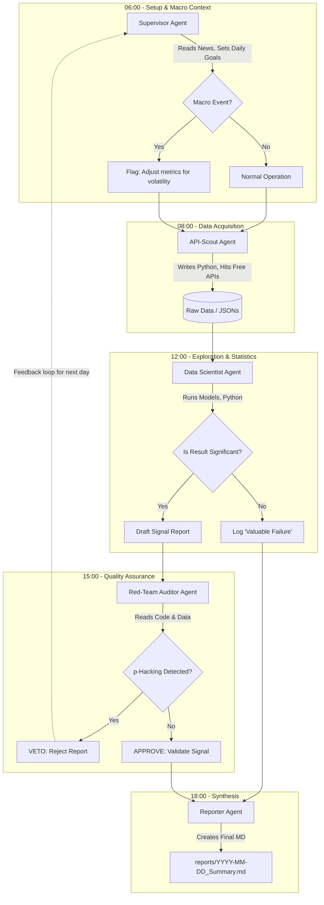

# Ardem - Signal-Agenten Testbed Design (Jules Workflow)

## 1. Einleitung & Kontext: "Ardem" und seine Konkurrenten
Das vorliegende Testbed-Design überträgt die Konzepte der rekursiven Signal-Agenten-Architektur auf ein konkretes, iteratives und kostenloses Setup mittels Google Jules und lokalen, wiederkehrenden Aufgaben (z.B. Cron-Jobs oder dedizierten Task-Schedulern anstelle von GitHub Actions). Als Testobjekt dient das Videospiel **"Ardem"**, ein immersives Open-World Survival MMO, in dem Spieler in einer von einem Virus verwüsteten Welt überleben, craften und die Zivilisation wieder aufbauen müssen.

Um relevante Marktsignale zu generieren, müssen die Agenten die direkte Konkurrenz analysieren. Typische Konkurrenten für "Ardem" sind:
- **DayZ:** Der Pionier des Hardcore-Survival-Genres.
- **Rust:** Starker Fokus auf Base-Building, PvP und regelmäßige Wipes/Updates.
- **SCUM:** Hohe Komplexität durch tiefgehende Charaktermetabolismen und Crafting.
- **Project Zomboid:** Isometrischer Ansatz, aber sehr tiefe Survival-Mechaniken und mod-getriebene Community.
- **7 Days to Die:** Starker Fokus auf Voxel-Building und Horden-Survival.

Ziel des Testbeds ist es, über wiederkehrende cron-basierte Aufgaben (Sessions) neue, signifikante Korrelationen zwischen den Metriken dieser Konkurrenten und dem potenziellen Markterfolg von "Ardem" zu entdecken, ohne auf teure Cloud-Infrastruktur angewiesen zu sein.

## 2. Agenten-Rollen, Freiheiten und Workflow

Das System wird durch verschiedene Prompts (Rollen) gesteuert, die als zeitlich versetzte, wiederkehrende Aufgaben (Cron-Jobs) aufgerufen werden. Die Ergebnisse jeder Session werden als Markdown-Berichte in einem dedizierten `reports/`-Verzeichnis gespeichert. Jeder Bericht enthält strikte Metadaten (Timestamp, ausführende Rolle, gefundene Einsichten, Signifikanz-Check).

### Die Rollen (Prompts)

1. **Der "Supervisor" (Meta-Agent / Orchestrator)**
   - **Aufgabe:** Koordiniert den Tagesablauf. Liest alte Reports und entscheidet, welche Hypothesen heute getestet werden sollen. Sucht nach "Black Swan"-Events via Google News, die die Daten verzerren könnten.
   - **Freiheiten:** Nur Lesezugriff auf Berichte und Google-Suche (Texte lesen). Darf *keinen* Code schreiben oder Daten scrapen.
   - **Ausführung:** Täglich morgens (z.B. 06:00 Uhr).

2. **Der "API-Scout" (Data Gatherer)**
   - **Aufgabe:** Findet und nutzt *kostenlose* APIs (z.B. SteamSpy, Steam Web API, Twitch API, Gamalytic Free Tier). Holt rohe Metriken der Konkurrenten (z.B. CCU-Spikes bei SCUM nach einem bestimmten Update-Typ).
   - **Freiheiten:** Darf Code schreiben (Python), um APIs abzufragen. Darf im Web nach neuen, offenen Datenquellen suchen. Scrapt aktiv strukturierte Daten.
   - **Ausführung:** Täglich vormittags (z.B. 08:00 Uhr).

3. **Der "Data Scientist" (Hypothesis & Insights Generator)**
   - **Aufgabe:** Nimmt die Roaddaten des API-Scouts und wendet beliebige Data-Science-Methoden (Pandas, Scikit-Learn, Statsmodels) in Python an. Versucht, unkonventionelle Signale zu finden (z.B. "Korreliert die Sentiment-Analyse der Steam-Reviews von DayZ mit der Anzahl an Base-Building-Updates?").
   - **Freiheiten:** Volle Freiheit, Python-Code für statistische Analysen und Machine Learning zu schreiben. **Strikte Vorgabe:** Darf nicht "p-hacken". Ergebnisse müssen statistisch sauber, redlich und signifikant (p < 0.05) sein. Nur signifikante Ergebnisse gelten als Erfolg, Fehlschläge ("Valuable Failures") müssen ebenfalls dokumentiert werden.
   - **Ausführung:** Täglich mittags (z.B. 12:00 Uhr), arbeitet so lange, bis ein signifikantes Ergebnis oder ein wertvoller Fehlschlag dokumentiert ist.

4. **Der "Red-Team Auditor" (Quality Assurance & Scientific Integrity)**
   - **Aufgabe:** Prüft die Code-Traces und Reports des Data Scientists. Hat er Ausreißer ohne guten Grund gelöscht, um das Ergebnis signifikant zu machen? Hat er "Happy-Pathing" betrieben?
   - **Freiheiten:** Liest Code und Logs. Darf Berichte mit einem "Veto" markieren, wenn methodisch unsauber gearbeitet wurde.
   - **Ausführung:** Täglich nachmittags (z.B. 15:00 Uhr).

5. **Der "Reporter" (Synthesis & Summary)**
   - **Aufgabe:** Führt die freigegebenen Insights der letzten 24 Stunden zusammen und erstellt den finalen Management-Report für die Entwickler/Investoren von Ardem.
   - **Freiheiten:** Reiner Text-Agent. Liest die validierten Markdown-Dateien und fasst sie verständlich zusammen.
   - **Ausführung:** Täglich abends (z.B. 18:00 Uhr).

## 3. Architektur- und Workflow-Graph (Mermaid)

Das folgende Diagramm visualisiert den zeitlichen Ablauf und die Interaktion der Agenten in einem typischen Tageszyklus:



## 4. Struktur eines Berichts (Report Metadata)

Jeder Agent speichert seine Arbeit in einem Ordner (z.B. `reports/raw/` oder `reports/validated/`). Ein typischer Header für eine solche Datei sieht so aus:

```markdown
---
timestamp: 2024-05-20T12:34:56Z
agent_role: "Data Scientist"
game_context: "Ardem vs. Rust"
data_sources: ["Steam Web API", "Twitch Free Tier API"]
methodology: "Linear Regression (Pandas, Statsmodels)"
significance_p_value: 0.034
status: "Pending Audit"
---

### Was wurde untersucht?
Wir haben geprüft, ob ein Anstieg der Twitch-Zuschauerzahlen bei Rust-Wipe-Events direkt mit einem Anstieg der Steam-Wishlists bei ähnlichen Survival-Games korreliert.

### Das Ergebnis
[...Details der Analyse...]
```
