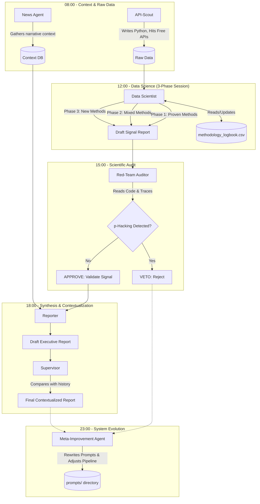

# Ardem - Signal-Agent Testbed Design

## 1. Introduction & Context: "Ardem" and its Competitors

This testbed design implements a recursive, self-improving signal-agent architecture. It utilizes local, recurring tasks (e.g., cron jobs or dedicated task schedulers) to maintain an iterative, zero-cost data exploration environment. The primary subject is **"Ardem"**, an immersive open-world survival MMO where players survive in a virus-ravaged world, craft items, and rebuild civilization.

To generate actionable market signals, the agents must analyze direct competitors. Typical competitors for "Ardem" include:

- **DayZ:** The pioneer of the hardcore survival genre.
- **Rust:** Heavy focus on base-building, PvP, and regular wipe/update cycles.
- **SCUM:** High complexity with deep character metabolism and crafting systems.
- **Project Zomboid:** Isometric approach, but features very deep survival mechanics and a mod-driven community.
- **7 Days to Die:** Strong focus on voxel-building and horde-survival mechanics.

The objective of this testbed is to discover new, statistically significant correlations between competitor metrics and the potential market success of "Ardem" using a highly structured, self-improving agent pipeline.

## 2. Agent Roles, Autonomy, and Workflow

The system is governed by specialized prompts (roles) executed sequentially via scheduled cron jobs. All work is conducted and logged strictly in English. Results, methodologies, and execution logs must be saved into a `logs/` and `reports/` directory structure sorted by the current system date.

### The Agent Roles

1. **The "Supervisor" (Executive Contextualizer)**
   - **Task:** Reviews the newly synthesized daily reports and places them into the broader context of *all* historical executive summaries and deep-dive reports. It acts as the final executive filter.
   - **Autonomy:** Read-only access to all reports. It connects dots across long timelines. It does *not* fetch macro-events (that is no longer its role) and does *not* write code.
   - **Execution Time:** Daily, early morning.

2. **The "News Agent" (Domain-Specific Context)**
   - **Task:** Actively searches and analyzes current news, social media sentiment, and community updates *specifically* related to "Ardem" and the defined hardcore survival competitors.
   - **Autonomy:** Utilizes Google search and text extraction to identify narrative trends (e.g., "Players are complaining about cheaters in the latest Rust wipe").
   - **Execution Time:** Daily, morning.

3. **The "API-Scout" (Data Gatherer)**
   - **Task:** Discovers and connects to free APIs (e.g., Steam Web API, Twitch API, Gamalytic Free Tier). Scrapes structured raw metrics (e.g., concurrent user spikes, review volumes).
   - **Autonomy:** Writes Python code to query APIs. Actively seeks out new open data sources.
   - **Execution Time:** Daily, mid-morning.

4. **The "Data Scientist" (Hypothesis & Insights Generator)**
   - **Task:** Processes the raw data using advanced Python libraries (Pandas, Scikit-Learn). Maintains and updates a `methodology_logbook.csv`.
   - **Session Structure:**
     - *Phase 1: Proven Methods.* Executes methodologies from the logbook rated highly (e.g., >80/100) to ensure baseline reliable metrics are generated.
     - *Phase 2: Mixed-Result Methods.* Reviews methodologies rated moderately (e.g., 60/100) and attempts to refine or apply them to new datasets to see if they yield better results this time.
     - *Phase 3: Innovation.* Must propose and test at least one completely new, state-of-the-art methodology (e.g., applying Topological Data Analysis to player overlap).
   - **Autonomy:** Full coding freedom for statistical analysis. Must strictly adhere to scientific honesty (no p-hacking). Must log all attempts, even failures.
   - **Execution Time:** Daily, noon.

5. **The "Red-Team Auditor" (Quality Assurance)**
   - **Task:** Reviews the code traces and data handling of the Data Scientist. Checks for fabricated significance, unjustified exclusion of outliers, and "happy-pathing."
   - **Autonomy:** Reads code and logs. Can issue a "VETO" to reject unscientific reports.
   - **Execution Time:** Daily, afternoon.

6. **The "Reporter" (Synthesis & Summary)**
   - **Task:** Merges the validated insights from the Data Scientist and the narrative context from the News Agent into a final, coherent executive report.
   - **Autonomy:** Text-only agent. Synthesizes Markdown files.
   - **Execution Time:** Daily, late afternoon.

7. **The "Meta-Improvement Agent" (Pipeline Architect)**
   - **Task:** Reviews the entire daily pipeline from a meta-perspective. Analyzes execution logs, prompt effectiveness, rejection rates by the Auditor, and overall bloat.
   - **Autonomy:** Has the authority to dynamically rewrite and improve the system prompts for *all other agents*. Can suggest expanding or shrinking the pipeline size. If the Data Scientist is stuck in a rut, this agent rewrites its prompt to force creativity.
   - **Execution Time:** Daily, night.

## 3. Architecture and Workflow Graph (Mermaid)

