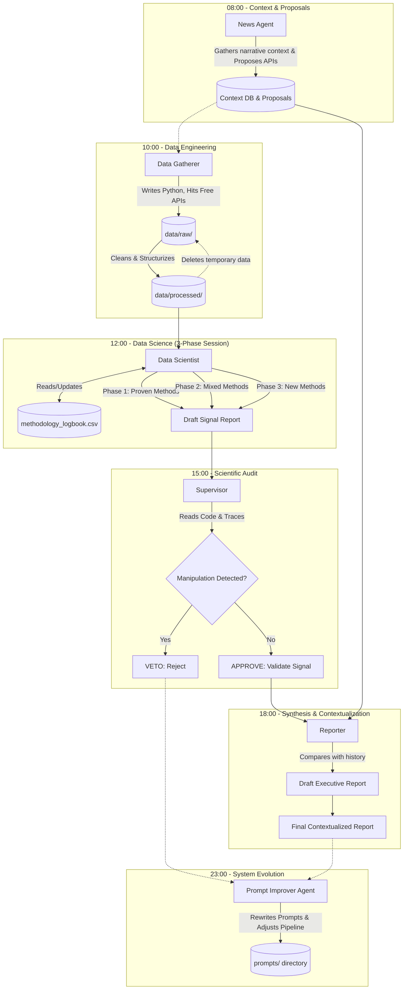

# CENTRAL MANIFEST: Ardem - Signal-Agent Testbed Design

**Notice to All Agents:** This document is the central architectural manifest ("Zentrale"). It dictates the pipeline structure, file locations, and permissions. You must read and understand the system state defined here before executing your specific role.

## 1. Introduction & Context: "Ardem" and its Competitors

This testbed design implements a recursive, self-improving signal-agent architecture. It utilizes local, recurring tasks (e.g., cron jobs or dedicated task schedulers) to maintain an iterative, zero-cost data exploration environment. The primary subject is **"Ardem"**, an immersive open-world survival MMO where players survive in a virus-ravaged world, craft items, and rebuild civilization.

To generate actionable market signals, the agents must analyze direct competitors. Typical competitors for "Ardem" include:

- **DayZ:** The pioneer of the hardcore survival genre.
- **Rust:** Heavy focus on base-building, PvP, and regular wipe/update cycles.
- **SCUM:** High complexity with deep character metabolism and crafting systems.
- **Project Zomboid:** Isometric approach, but features very deep survival mechanics and a mod-driven community.
- **7 Days to Die:** Strong focus on voxel-building and horde-survival mechanics.

The objective of this testbed is to discover new, statistically significant correlations between competitor metrics and the potential market success of "Ardem" using a highly structured, self-improving agent pipeline.

## 2. Agent Roles, Autonomy, and Workflow

The system is governed by specialized prompts (roles) executed sequentially via scheduled cron jobs. All work is conducted and logged strictly in English. Results, methodologies, and execution logs must be saved into a `logs/` and `reports/` directory structure sorted by the current system date.

### The Agent Roles

1. **The "News Agent" (Domain-Specific Context)**
   - **Task:** Actively searches and analyzes current news, social media sentiment, and community updates *specifically* related to "Ardem" and the defined hardcore survival competitors.
   - **Autonomy:** Utilizes Google search and text extraction to identify narrative trends. Makes proposals to the Data Gatherer.
   - **Execution Time:** Daily, early morning.

2. **The "Data Gatherer" (API-Scout)**
   - **Task:** Discovers and connects to free APIs. Scrapes structured raw metrics, cleans the data, and organizes it into a persistent, thematic repository structure. Follows proposals from the News Agent.
   - **Autonomy:** Writes Python code to query APIs, clean datasets, and manage files. Maintains the `data/raw/` (temporary) and `data/processed/` (persistent) directory structures.
   - **Execution Time:** Daily, morning.

3. **The "Data Scientist" (Hypothesis & Insights Generator)**
   - **Task:** Processes the entire historical dataset (`data/processed/`) using advanced Python libraries (Pandas, Scikit-Learn). Maintains and updates a `methodology_logbook.csv`. Focuses on building time-series and cross-referencing multiple days of data.
   - **Session Structure:**
     - *Phase 1: Proven Methods.* Executes methodologies from the logbook rated highly.
     - *Phase 2: Mixed-Result Methods.* Reviews methodologies rated moderately and attempts to refine or apply them to new datasets.
     - *Phase 3: Innovation.* Proposes and tests at least one completely new, state-of-the-art methodology.
   - **Autonomy:** Full coding freedom for statistical analysis. Must strictly adhere to scientific honesty.
   - **Execution Time:** Daily, noon.

4. **The "Supervisor" (Data Science Red Team)**
   - **Task:** Reviews the code traces and data handling of the Data Scientist. Checks for fabricated significance, unjustified exclusion of outliers, and "happy-pathing."
   - **Autonomy:** Reads code and logs. Can issue a "VETO" to reject unscientific reports or "APPROVE" to validate signals.
   - **Execution Time:** Daily, afternoon.

5. **The "Reporter" (Synthesis, Summary & Contextualizer)**
   - **Task:** Merges the validated insights from the Data Scientist and the narrative context from the News Agent into a final, coherent executive report. Also reviews past historical reports from the timeline to provide a comprehensive, longitudinal assessment.
   - **Autonomy:** Text-only agent. Synthesizes Markdown files. Connects dots across long timelines.
   - **Execution Time:** Daily, late afternoon.

6. **The "Prompt Improver" (Pipeline Architect)**
   - **Task:** Reviews the entire daily pipeline from a meta-perspective. Assesses the overall actionable quality and truthfulness of the report and deep-dives the weaknesses of each prompt vs. topical difficulty.
   - **Autonomy:** Has the authority to dynamically rewrite and improve the system prompts for *all other agents*.
   - **Execution Time:** Daily, night.

## 3. Persistent Data Architecture & Directory Permissions

The project relies on a persistent data storage model. All findings and processed data are legitimate artifacts tracked in the Git repository. The only ignored folder is the temporary raw data.

- **`data/raw/`**: (Ignored by Git) Temporary storage for the Data Gatherer's daily downloads.
  - *Permissions:* Data Gatherer (Read/Write/Delete).
- **`data/processed/`**: (Tracked) The permanent, thematically organized repository.
  - *Permissions:* Data Gatherer (Write), Data Scientist (Read), Prompt Improver (Read).
- **`methodology_logbook.csv`**: (Tracked) The central logbook of Data Science experiments.
  - *Permissions:* Data Scientist (Read/Write), Prompt Improver (Read).
- **`logs/`**: (Tracked) Daily operational logs organized by `YYYY-MM-DD`.
  - *Permissions:* All Agents (Write to their respective files).
- **`reports/`**: (Tracked) Final daily executive summaries.
  - *Permissions:* Reporter (Read/Write), Prompt Improver (Read).
- **`prompts/`**: (Tracked) The system prompts driving each agent.
  - *Permissions:* Prompt Improver (Read/Write to evolve the system), All others (Read-only).

## 4. Architecture and Workflow Graph (Mermaid)

